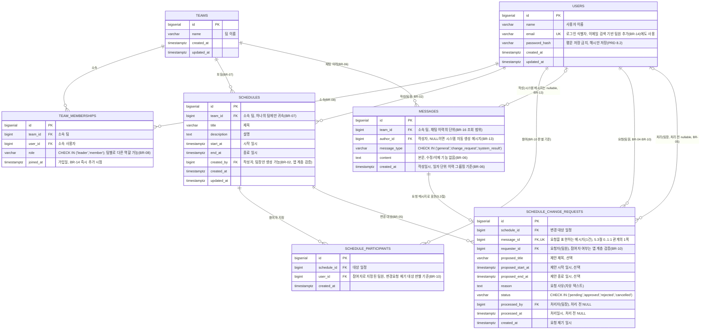

# Team CalTalk 데이터베이스 ERD

| 버전 | 일자 | 작성자 | 변경 내용 |
|---|---|---|---|
| v1.0 | 2026-07-10 | Team CalTalk 데이터베이스 설계 | 최초 작성 |

## 1. 문서 개요

### 1.1 목적
본 문서는 `1-domain-definition.md`(v1.2)에서 정의한 엔티티(ENT-01~07)와 비즈니스 규칙(BR-01~16)을, `2-PRD.md`(v1.1) 9장이 지정한 PostgreSQL 위에서 구현 가능한 관계형 스키마로 구체화한다. 개념 모델(도메인 정의서 5장)을 테이블·컬럼·제약조건 수준으로 옮기는 것이 목적이며, 실제 마이그레이션 DDL 작성은 본 문서를 기준으로 후속 구현 단계에서 진행한다.

### 1.2 참고 문서
- `docs/1-domain-definition.md` (v1.2) — 엔티티(ENT-01~07), 비즈니스 규칙(BR-01~16), 5장 개념 모델
- `docs/2-PRD.md` (v1.1) — 7장 기능 요구사항(Must-have), 8.2절 보안 요건(비밀번호 해시 저장), 9장 기술 아키텍처(PostgreSQL)

### 1.3 범위
도메인 정의서 8장 및 PRD 6.2절의 Out of Scope 항목(개인 전용 캘린더, 채팅 파일첨부/이모지/메시지 수정삭제, 조직/부서 계층, 관리자 콘솔, 다국어/타임존 세부처리, 결제/구독, 감사 로그·알림 테이블 등)에 대응하는 테이블은 본 스키마에 포함하지 않는다. ENT-01~07에 대응하는 7개 테이블만을 다룬다.

### 1.4 명명 규칙
`6-project-structure.md`의 규칙을 따라 테이블명은 snake_case 복수형, 컬럼명은 snake_case를 사용한다(예: `schedule_change_requests`, `created_at`).

## 2. ERD (Mermaid)

### 2.1 Mermaid로 표현되지 않는 보조 제약
Mermaid `erDiagram` 문법은 컬럼 단위 PK/FK/UK만 표기할 수 있어 아래 복합 제약은 다이어그램 밖에 별도로 명시한다.

| 테이블 | 제약 | 목적 |
|---|---|---|
| `team_memberships` | `UNIQUE(team_id, user_id)` | 동일 사용자가 동일 팀에 중복 소속(중복 행)되는 것을 방지 |
| `schedule_participants` | `UNIQUE(schedule_id, user_id)` | 동일 일정에 동일 팀원이 참여자로 중복 지정되는 것을 방지 |
| `schedule_change_requests` | `message_id UNIQUE` | Message 1건당 ScheduleChangeRequest 1건 이하(5.3절 0..1:1) 보장 |
| `messages` | `CHECK (message_type <> 'system_result' OR author_id IS NULL)` (권장) | 시스템 처리결과 메시지는 작성자가 없어야 함(BR-13)을 데이터 수준에서 보조 검증 |

## 3. 엔티티-테이블-비즈니스 규칙 추적 매트릭스

도메인 정의서 9장 추적 매트릭스와 동일한 형식으로, ENT-xx가 어느 테이블에 대응하고 어느 BR-xx를 지원/부분 집행하는지 정리한다.

| ENT ID | 엔티티 | 대응 테이블 | 지원/집행하는 BR-xx | 비고 |
|---|---|---|---|---|
| ENT-01 | User | `users` | BR-01, BR-08, PRD 8.2 | `password_hash`로 평문 저장 금지 요건 반영 |
| ENT-02 | Team | `teams` | BR-07, BR-15 | 모든 주요 엔티티의 소유 기준(PRD 8.1 확장성 원칙) |
| ENT-03 | TeamMembership | `team_memberships` | BR-08, BR-09(부분), BR-14, BR-15 | `role` 컬럼으로 팀별 상이한 역할 표현(BR-08) |
| ENT-04 | Schedule | `schedules` | BR-02, BR-03, BR-07 | `team_id` NOT NULL FK로 단일 팀 귀속(BR-07) 강제 |
| ENT-05 | ScheduleParticipant | `schedule_participants` | BR-10 | 변경 요청 제기 가능 대상 판별의 데이터 기준 |
| ENT-06 | Message | `messages` | BR-06, BR-13, BR-16 | `message_type`으로 일반/변경요청/시스템 처리결과 구분 |
| ENT-07 | ScheduleChangeRequest | `schedule_change_requests` | BR-04, BR-05, BR-10, BR-11(부분), BR-12, BR-13 | `status` CHECK로 대기/승인/거절/취소 표현 |

## 4. DB 제약만으로 강제할 수 없는 규칙 (애플리케이션 계층 필수)

아래 BR-xx는 스키마의 PK/FK/UK/CHECK 제약만으로는 완전히 표현되지 않으며, 반드시 백엔드 서비스 계층(Route→Service→Query, `5-arch-diagram.md` 참조)에서 검증해야 한다. 이 목록이 스키마 문서에서 유실되지 않도록 명시적으로 남긴다.

| BR ID | 규칙 요약 | DB 제약만으로 부족한 이유 | 앱 계층 처리 방향 |
|---|---|---|---|
| BR-01 | 인증된 사용자만 이용 가능 | 세션/토큰 검증은 스키마의 대상이 아님 | 모든 API 요청에 대해 인증 미들웨어에서 검증 |
| BR-02, BR-03 | 일정 쓰기(생성/수정/삭제)는 팀장 전용, 팀원은 조회만 | FK/CHECK만으로는 "요청자의 현재 역할"을 판단할 수 없음(역할은 시점에 따라 변할 수 있는 `team_memberships.role` 값) | 요청 시점에 `team_memberships`를 조회해 `role='leader'`인지 검증 |
| BR-09 | 팀에는 최소 1명 이상의 팀장이 항상 존재해야 함 | "이 UPDATE/DELETE 이후 해당 팀의 leader 수가 0이 되는가"는 단순 CHECK로 표현 불가(다른 행 상태에 의존하는 집합 제약) | 팀원 제외·역할 변경 API에서 트랜잭션 내 사전 카운트 검증(트리거로 구현할 수도 있으나 MVP 범위에서는 서비스 계층 검증으로 충분) |
| BR-10 | 팀원은 자신이 참여자로 지정된 일정에 대해서만 변경 요청 가능 | `schedule_change_requests.requester_id`가 해당 `schedule_id`의 `schedule_participants`에 존재하는지는 FK가 아닌 교차 테이블 조건이라 CHECK 불가 | 요청 생성 API에서 `EXISTS` 서브쿼리로 참여자 여부 확인 후 insert |
| BR-11 | 하나의 대기 요청 승인 시 동일 일정의 나머지 대기 요청 자동 거절 | 다중 행에 걸친 부수 효과(cascading side-effect)이며 단순 제약이 아닌 절차적 로직 | 승인 처리 트랜잭션 내에서 동일 `schedule_id`, `status='pending'`인 나머지 요청을 일괄 `rejected`로 UPDATE 후 시스템 메시지 생성 |
| BR-12 | 요청자 본인만, 대기 상태일 때만 취소 가능 | "취소를 시도하는 사용자가 requester_id 본인인지"와 "현재 status가 pending인지"는 요청 시점의 세션 컨텍스트와 결합된 검증이라 CHECK만으로 불가 | 취소 API에서 세션 사용자 == `requester_id` AND `status='pending'` 조건을 서비스 계층에서 검증 |
| BR-14 | 팀장은 이미 가입된 사용자만 이메일 검색으로 즉시 추가 가능 | FK 제약상 `team_memberships.user_id`가 `users`에 존재해야 하는 것은 보장되지만, "검색 대상 이메일이 실제 존재하는지"를 API가 사전에 안내하는 흐름은 애플리케이션 로직 | 팀원 추가 API에서 이메일로 `users` 조회 후 없으면 오류 응답, 있으면 `team_memberships` insert |
| BR-15 | 팀 생성자는 자동으로 해당 팀의 팀장으로 등록 | `teams` insert와 `team_memberships` insert는 별개 테이블에 대한 두 번의 쓰기이며 DB가 자동으로 연결해주지 않음 | 팀 생성 API가 하나의 트랜잭션 안에서 `teams` insert 후 생성자에 대해 `role='leader'`인 `team_memberships` insert를 함께 수행 |
| BR-16 | 소속되지 않은 팀의 일정/채팅/팀 정보 접근 불가 | 스키마의 FK는 데이터 무결성만 보장할 뿐 "누가 조회 가능한가"라는 인가 규칙은 아님(Row-Level Security를 적용하지 않는 한) | 모든 조회/조작 API에서 요청자의 `team_memberships` 소속 여부를 서버 측에서 검증(PRD 8.2절과 동일) |

## 5. 설계 판단 근거

### 5.1 기본 키(PK) 타입: BIGSERIAL(자동 증가 정수)
UUID 대신 `BIGSERIAL`을 선택했다. 도메인 정의서·PRD 어디에도 "추측 불가능한 외부 노출 ID"를 요구하는 BR이 없고, 팀 경계 접근 제어(BR-16)는 ID의 예측 가능성이 아니라 매 요청마다 서버 측에서 `team_memberships` 소속 여부를 검증하는 방식(8.2절)으로 이미 보장된다. 5일/1인 개발 일정상 UUID 확장 설정, 더 큰 인덱스 크기로 인한 조인 비용 등 불필요한 복잡도를 피하고, 정수 PK로 조인·정렬 성능을 확보하는 쪽이 실용적이라 판단했다. 추후 외부에 노출해도 안전한 식별자가 필요해지면 별도의 `public_id`(uuid) 컬럼을 추가하는 방식으로 내부 관계를 깨지 않고 확장 가능하다.

### 5.2 enum 표현: 네이티브 ENUM 타입 대신 CHECK 제약
`team_memberships.role`, `messages.message_type`, `schedule_change_requests.status`는 PostgreSQL 네이티브 `ENUM` 타입 대신 `varchar + CHECK (... IN (...))` 조합으로 설계했다. 5일 스프린트 동안 값 추가/변경 가능성이 있는데, PostgreSQL의 `ALTER TYPE ... ADD VALUE`는 트랜잭션 내 사용 제약이 있고 값 삭제가 불가능해 반복적인 마이그레이션 수정에 불리하다. `CHECK` 제약은 `ALTER TABLE ... DROP CONSTRAINT / ADD CONSTRAINT`로 자유롭게 교체 가능해 MVP 반복 개발에 더 적합하다고 판단했다.

### 5.3 Message ↔ ScheduleChangeRequest 연결: 단일 FK만 유지, 이중 FK(결과 메시지 역참조) 미채택
도메인 정의서 5.3절은 "ScheduleChangeRequest는 특정 Message(요청을 표현하는 메시지)와 연결된다"는 관계 하나만 정의하며, ENT-06/ENT-07의 속성 목록 어디에도 "시스템 처리결과 메시지로의 역참조" 컬럼은 명시되어 있지 않다. 이에 따라 `schedule_change_requests.message_id`(요청 메시지, UNIQUE FK)만 두고, BR-13에서 요구하는 "처리 결과를 알리는 시스템 메시지"는 별도의 역참조 FK(`result_message_id`) 없이 `messages` 테이블에 `message_type='system_result'`, `author_id=NULL`인 새 행을 추가하는 것만으로 표현한다.

이 결정의 근거는 다음과 같다.
1. BR-13이 실제로 요구하는 것은 "처리 결과가 해당 요청이 제기된 **채팅 이력**에 기록되어 요청자가 확인할 수 있어야 한다"는 것이지, 두 레코드 간의 정규화된 참조 무결성이 아니다. `team_id`와 `created_at`(일자 단위 이력 그룹핑, BR-06) 기준으로 같은 채팅 이력 안에 노출되면 요구사항을 충족한다.
2. 문서에 근거 없는 컬럼을 추가하지 않는다는 설계 원칙(본 문서 1.3절, 도메인 정의서 8장)에 따라, 명시적으로 정의되지 않은 관계를 스키마에 선반영하지 않는다.
3. 필요하다면 시스템 메시지의 `content`에 대상 일정/요청을 사람이 읽을 수 있는 형태로 포함시켜(자유 텍스트이므로 제약 없음) UI에서 맥락을 보여줄 수 있어, 역참조 FK가 없어도 기능적 공백이 발생하지 않는다.

향후 "이 시스템 메시지가 정확히 어느 요청의 처리 결과인지" 프로그램적으로 강한 결합이 필요해지면, `schedule_change_requests`에 nullable UNIQUE FK(`result_message_id`)를 추가하는 마이그레이션으로 확장 가능하며, 이는 기존 스키마를 깨지 않는 하위 호환 변경이다.
