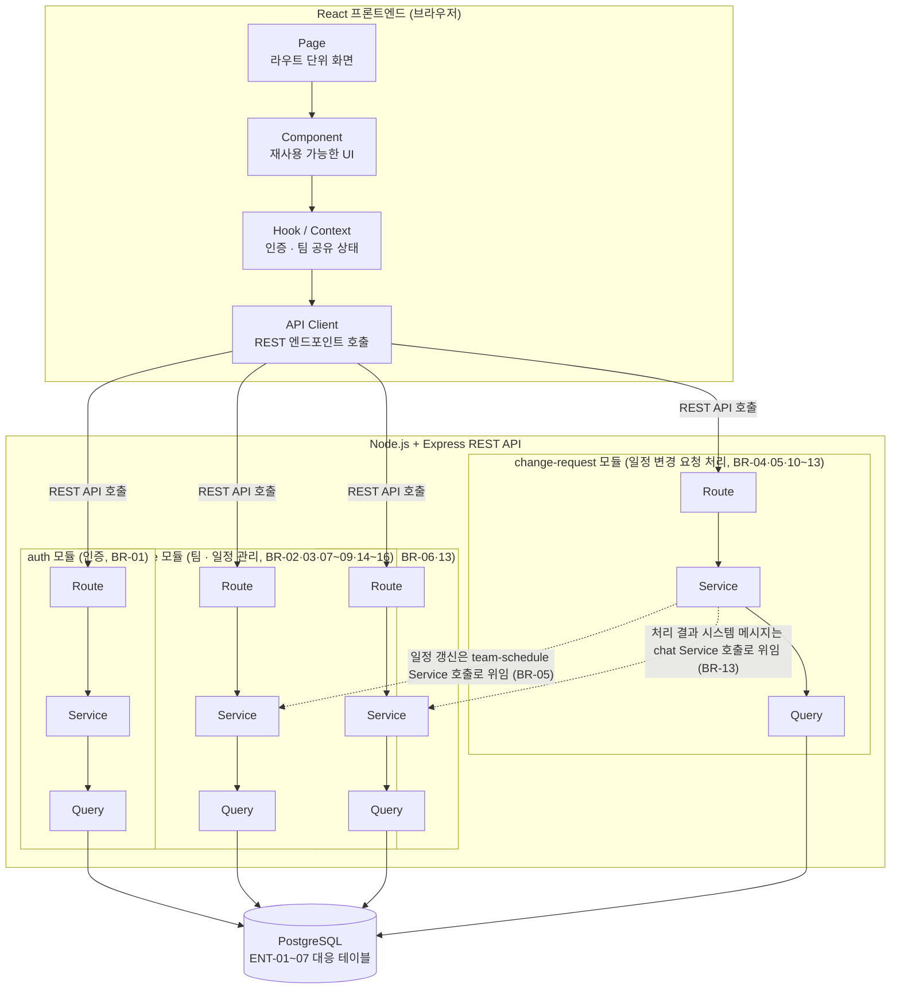
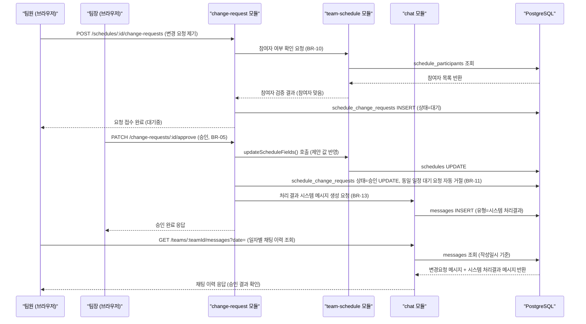

# Team CalTalk 기술 아키텍처 다이어그램

## 참고 문서
1. `docs/1-domain-definition.md` (v1.2) — 엔티티(ENT-01~07), 비즈니스 규칙(BR-01~16)
2. `docs/2-PRD.md` (v1.1) — 9장 기술 아키텍처 개요(React / Node.js+Express / PostgreSQL, REST API)
3. `docs/3-user-scenarios.md` (v1.1) — SC-06(변경 요청 제기), SC-07(승인) 시나리오
6. `docs/6-project-structure.md` — 백엔드 4개 기능 모듈(auth / team-schedule / chat / change-request) 및 계층 구조(Route→Service→Query, Page→Component→Hook/Context→API Client)

본 문서는 PRD 9장이 정한 3계층(React 프론트엔드 / Node.js+Express 백엔드 / PostgreSQL)만을 대상으로 하며, 문서에 근거 없는 캐시·메시지 브로커·별도 인증 서버 등은 포함하지 않는다.

---

## 1. 전체 시스템 구성도

React 프론트엔드가 REST API를 통해 Node.js+Express 백엔드의 4개 기능 모듈(auth / team-schedule / chat / change-request)을 호출하고, 각 모듈은 자신의 Route→Service→Query 계층을 거쳐 단일 PostgreSQL 데이터베이스에 접근하는 3단 구조를 보여준다.

---

## 2. 핵심 데이터 흐름 시퀀스 다이어그램

팀원이 자신이 참여자로 지정된 일정에 대해 채팅으로 변경을 요청하고(BR-04, BR-10), 팀장이 이를 승인하면 실제 Schedule에 반영되며(BR-05) 그 처리 결과가 시스템 메시지로 채팅 이력에 자동 기록되는(BR-13) 대표 흐름이다(SC-06, SC-07 대응).

